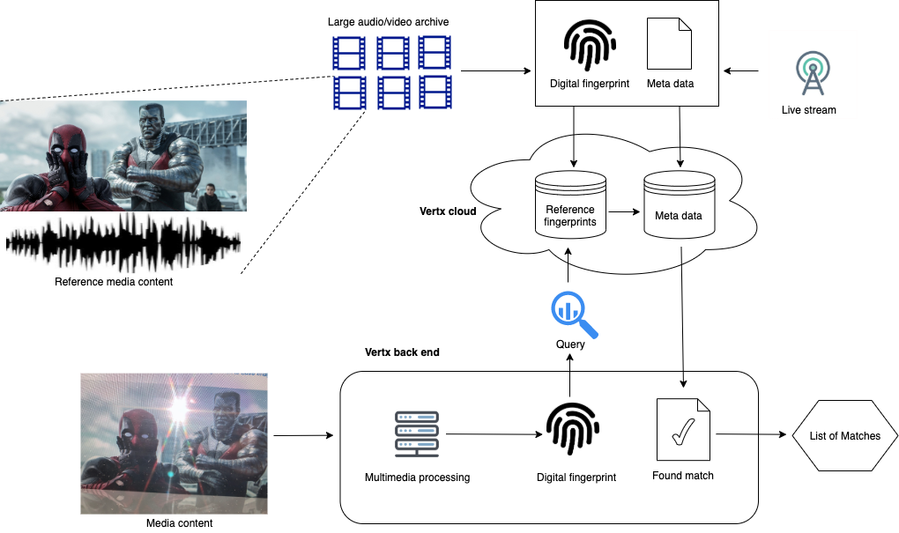

# How to start identifying audio/video content with Vertx 
Vertx provides solutions for **content-based multimedia search** (query by example) in large-scale multimedia databases
containing millions of items. It's very much like "Shazam" but extended to work with videos. 
It has the ability to operate on severely distorted media content
(for example, camera jitter, screen with glare, acoustic noise) and can robustly identify content from multimedia clips.

### What can Vertx do for you:
- **_Identify music and movies on mobile devices:_** point cellphone camera at a TV screen and get the titles of the movie and the song being played.  
- **_Copyright protection:_** scan video and audio content against a database of copyrighted music, movies, and TV shows;
  find instantly any matching items in user uploaded clips.
- **_Duplicate detection:_** scan your multimedia catalogue and detect duplicate content.
- **_Live broadcast monitoring:_** scan live multimedia streams and find matches with broadcast TV or radio channels.
- **_On-device content identification:_** identify audio and video content on a mobile device with no internet connection.

### Getting started: <!--section_break-->
- Send us a [message](https://vertx.ai/#contact) to get your API key if you don't have it yet.<!--section_break-->
- Explore Vertx API in the [Playground](https://portal.vertx.ai/playground) and start integrating it into your product.
- Join [VertxAI Slack](https://join.slack.com/t/vertx-ai/shared_invite/zt-l2j9eett-5UYrpvy_cGp7OG~TgmFvhA) community to get help.
- [Contact us](https://vertx.ai/#contact) if you have any questions or specific requirements enquiries.

<!--section_break-->

# Vertx Technology
Vertx technology facilitates reverse audio/video search at a large scale.
It works amazingly fast, allowing one to identify any piece of content within a blink of an eye.
Check out this [YouTube video](https://youtu.be/QFz1yxtYYRQ) that was captured using a cellphone camera
pointed at a TV screen running "Troy" movie and some music in the background.

<!--section_break-->

<!--section_break-->

Vertx is able to scan the audio and video content of the clip against multimedia databases
containing millions of songs and thousands of movies and identify all the matches in a second.

The video file `sample.mp4` will be used in API search  request examples throughout the rest of the documentation and
can be downloaded following this [direct link](https://github.com/vertxai/vertx_cli/releases/download/v1.0.2/sample.mp4).

# Vertx API
One can search and register multimedia content through the Vertx API in a number of ways:
- Calling [REST API](#rest-api);
- Using [Vertx command line utility](#vertx-command-line-utility);
- Through the [container interface](#container-interface) (Docker and Podman are supported);
- iOS and Android SDKs.

**A valid API key is required to make any API calls.**

## REST API
The simplest way to start using Vertx technology is through the REST API.
One can call REST API either by making requests from the [Playground](https://portal.vertx.ai/playground) page
or using command line utilities like [curl](https://curl.se/). Follow this one-minute [video tutorial](https://www.youtube.com/watch?v=Ye3fP01fei4)
on how to play with the API directly from your browser in the [Playground](https://portal.vertx.ai/playground).

The media content is being uploaded to the Vertx Backend when calling REST API.
Digital fingerprints are extracted from the uploaded content and are matched against reference databases.

One can also use a command line utility like *curl* to directly call our API.
API key should be provided in the `X-Session-Token` header.
The command to find matches for `sample.mp4` in the public bucket is provided below:

```bash
curl -X POST "https://api.vertx.ai/v1/search/" -H "X-Session-Token: YOUR_VERTX_API_KEY" -F "media_file=@/path/to/sample.mp4" 
```

## Vertx Command Line Utility
One can also use Vertx command line utility to make API calls.
It employs edge computing to extract signatures from media content and uploads only digital fingerprints to the Vertx Backend.

The latest binary for Linux x86-64 platform can be downloaded from the [Github releases](https://github.com/vertxai/vertx_cli/releases) page.
The command to find matches for `sample.mp4` in the public bucket is provided below:

```bash
vertx --token YOUR_VERTX_API_KEY  sample.mp4
```

## Container Interface
One can also use the provided container image to run Vertx command line utility on the platforms where it is not available yet.
Please, install [docker](https://docs.docker.com/get-docker/) or [podman](https://podman.io/getting-started/installation)
container engines for your operating system and run the following command:

```bash
docker run -v $(pwd)/data:/data --rm vertxai/vertx_cli:latest /app/vertx --token YOUR_VERTX_API_KEY /data/sample.mp4
```

or

```bash
podman run -v $(pwd)/data:/data --rm vertxai/vertx_cli:latest /app/vertx --token YOUR_VERTX_API_KEY /data/sample.mp4
```

The command will download the latest container image with the Vertx command line utility and run the container.
It mounts local `./data/` directory to container `/data/` directory. Media files have to be copied to the local directory:
```bash
mkdir -p ./data/
cp sample.mp4 ./data/
```

# Interpreting Search Results
All Vertx tools deliver search results in JSON format. Each result contains the following JSON fields:

- `media_content` indicates type of the content being searched (audio or video);
- `source_path` - path of the source (query) file;
- `source_uid` - unique identifier of the source (query) file;
- `status` - status of the search call ("succeeded" or "failed").

Each result also contains a list of matches with the reference content:
- `type` - type of the reference content (can be `"movie"` or `"music"`);
- `title` - title of the reference content (track or movie title);
- `uid` - a unique identifier of the reference content.

Metadata information specific to movies:
- `imdb_id` - IMDB identifier of the reference movie;
- `year` - release year of the movie.

Metadata information specific to music:
- `artist` - artist;
- `album` - album.

Every match contains the following information:
- `duration` - duration (in seconds) of the match segment;
- `que_offset` - the offset to the match segment in the input (query) file (in seconds);
- `ref_offset` - the offset to the match segment in the reference item (in seconds).


The resulting JSON response for the `sample.mp4` request media file:

```json
[
  {
    "matches": [
      {
        "album": "Elephunk",
        "artist": "Black Eyed Peas; Papa Roach",
        "segments": [
          {
            "duration": 24.9375,
            "que_offset": 0.0,
            "ref_offset": 18.0
          }
        ],
        "title": "Anxiety",
        "type": "music",
        "uid": 6475547275973858650
      },
      {
        "imdb_id": 365957,
        "segments": [
          {
            "duration": 24.9375,
            "que_offset": 0.0,
            "ref_offset": 3500.625
          }
        ],
        "title": "You Got Served",
        "type": "movie",
        "uid": 1566530810344932800,
        "year": 2004
      }
    ],
    "media_type": "audio",
    "source_path": "sample.mp4",
    "source_uid": 1758730481226206085,
    "status": "succeeded"
  },
  {
    "matches": [
      {
        "imdb_id": 332452,
        "segments": [
          {
            "duration": 21.0,
            "que_offset": 0.0,
            "ref_offset": 8608.5
          }
        ],
        "title": "Troy",
        "type": "movie",
        "uid": 1342729426672482861,
        "year": 2004
      }
    ],
    "media_type": "video",
    "source_path": "sample.mp4",
    "source_uid": 1758730481226206085,
    "status": "succeeded"
  }
]
```

The content from `sample.mp4` file matched with three items from the public bucket.
Video content matched with the "Troy" movie, while audio content matched with the "Anxiety" music track by
"Black Eyed Peas" and "Papa Roach". The song was also used as a soundtrack in "You Got Served" movie.
Vertx was able to successfully identify all the matching segments, both audio and video.


# Vertx Architecture
Vertx technology is based on extracting digital signatures from audio and video content (called digital fingerprints)
and adding them to a searchable index.
Much likely like human fingerprints, digital fingerprints uniquely identify a chunk of audio/video content.
Fingerprints are highly compressed when compared to the original media content and it's not possible to restore
the original content from digital fingerprints.

The three main components of the Vertx ecosystem are Vertx Cloud, Vertx Backend and Vertx Clients.



Vertx Cloud stores indices of the reference content and serves search and registration requests from Vertx Backend.

Vertx Clients can upload media content for fingerprint extraction to the Vertx Backend servers through the REST API.

When using [Vertx command line utility](https://github.com/vertxai/vertx_cli/releases) or container interface,
fingerprint extraction happens on the client side and no original media content is being uploaded.
Only extracted fingerprints are sent to the Vertx backend servers for search or registration.

Metadata for all matched reference content is returned to the client.

All the reference content in the Vertx cloud is organized into buckets. Buckets can be private or public.
By default, all search requests are sent to public bucket. It contains fingerprints for millions of songs and thousands of movies.
Private buckets contain content registered by a particular customer (owner) and can only be accessed and managed by the owner.
An example of multimedia content registration in a private bucket `test_bucket`:
```bash
curl -X POST "https://api.vertx.ai/v1/media/test_bucket" \
 -H "Accept: application/json" \
 -H "X-Session-Token: YOUR_VERTX_API_KEY" \
 -H "Content-Type: multipart/form-data" \
 -F "media_file=@/path/to/media/file.mp4" \
 -F "metadata=@/path/to/metadata.json" 
```
Content sent to `test_bucket` private bucket for search will be scanned against registered items. 
For the complete set of API calls refer to the [Playground](https://portal.vertx.ai/playground) page. 

# Subscription plans
Vertx API is provided **free of charge** with the following limitations:
- 5 API calls per 10 seconds;
- Registration of custom content in private buckets is disabled.
  All search requests are sent to the public bucket containing millions of songs and thousands of movies.

Additional limitations on the search calls of the REST API:
- Max uploaded file size is 100 MB;
- Max media content length is 600 seconds;

If you need higher quotas limits or private bucket search functionality, paid subscription plan are available upon request.
[Contact us](https://vertx.ai/#contact) to get all the details!
